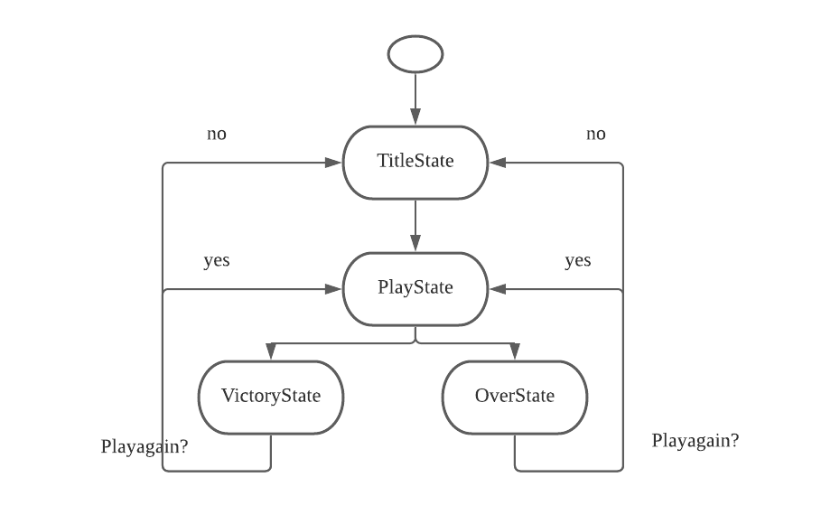

# Game Programming F21 Project - Magic Tower

- 💯**Worth**:
  - **Proposal**: 10%
  - **Implementation**: 20%
- 📅**Due**:
  - **Proposal**:
    - **Draft**: November 15, 2021 @ 23:59
    - **Final**: November 22, 2021 @ 23:59
  - **Implementation**: December 13, 2021 @ 23:59
- 🙅🏽‍**Penalty**: Late submissions lose 10% per day to a maximum of 3 days. Nothing is accepted after 3 days and a grade of 0% will be given.

## 🎯 Objectives

- Combine everything you've learned during this course to create your own video game.

## ✒️ Description
Magic Tower is a top-down tower game where the player use w,a,s,d keys to move up,left,down,and right. The player controls the warrior to fight with monsters in order to save the Princess.

## 🕹️ Gameplay

Player Use w,a,s,d on keyboard to move up,left,down and right. The Player and Monster has property attack and defense. Once player collid with the monster they will fight with each other. If player's attack value is higher than monster's denfese value, the player will win the battle and player's life value will be cost by calculating (Monster's attack value-Player's defense value) if Player's defense value is less than Monster's attack value. Once Player's life is less or equal to 0 game will over. The Player gets golds by defeating Monters and could use them to increase attack and defense values by shopping on the store. The store is located in the center of the map. There are two kinds of items on the floor for the Player to pick. Keys can be used to open the door and Wind could be used to drink to increase the Player's life values. If the Player defeat the final boss the Player win the game.

## 📃 Requirements

1. The user shall press "enter" to start the game.
2. The user shall press "w","a","s","d" to move up,left,down and right.
3. The user shall go up/down stairs by colliding with the floor.
4. The user shall start to fight with monsters by colliding with the monster.
5. The user shall press "y" to check monster's status.
6. The system shall execute any state after the user fight with a monster.
26. The user shall be able to play the game again once the game is over.

### 🤖 State Diagram

### 🗺️ Class Diagram

### 🎨 Assets

We used [app.diagrams.net](https://www.lucidchart.com/pages/) to create the wireframes and. Wireframes are the equivalent to the skeleton of a web app since they are used to describe the functionality of the product and the users experience..

The GUI will be kept simple and playful, as to make sure the game is easy to understand what each component does and is, as well as light hearted to keep to the Magic Tower theme.

#### 🖼️ Images

All image sources is come from m8705's repository https://github.com/m8705/MAGIC-TOWER-JS. It's for public using.

#### 🔊 Sounds

All sounds were taken from [13400](https://www.13400.com/ling/20947.html)and(https://soundcloud.com/ashamaluevmusic/sets/music-for-gaming-videos)
